##### 序言
本次主要使用 `golang` 重写 `email` 模块    

## 流程简述

###### 为什么拆分为 API 与 JOB
`API` 部分主要是为了接收外部的发送请求保证服务的可用性  
`JOB` 部分是为了让 `pop3` 密码要更换时，可以先停止服务防止邮件发送失败

###### 注意
文件大小限制请在服务器层面完成,如 `nginx`  
目前属于单机部署版本,只因为附件是临时存储到本地的  
如果不考虑附件，可以多机部署

小 `tip` 日常附件  
请尽量内网上传到对应 `对象存储服务`  
通过邮件文本，以附件链接的形式放出去

## 使用

#### 发送邮件

- API `127.0.0.1:8100/api/email/send`  
- 方式 `POST`
- 入参
    - `title` 邮件名
    - `content` 待发送正文,支持html
    - `sender_name` string 发件人昵称
    - `receiver` string 接收者邮箱.多个以逗号隔开
    - `receiver_name` string 接收者邮箱昵称,可以不填,多个以逗号隔开
    - `attachment[]` file 多个附件请使用相同变量名.请使用 form-data 进行传输

###### 示例:正常请求

~~~bash
{
    "code": 200,
    "message": "success",
    "data": null
}
~~~

###### 示例:异常请求

~~~bash
{
    "code": 400,
    "message": "Param is invalid",
    "data": null
}
~~~

###### 请求邮件通知服务

  
`图 001`  

###### 处理邮件发送

  
`图 002`  

#### 要求清单

* 接收发邮件的 HTTP 请求
    - 异步队列
        - [x] RabbitMQ
        - [x] Kafka
            - 请自行创建 Topic 然后配置 `kafkaTopic` 这个配置项
        - [x] 整合为简单工厂
    - 附件
        - [x] 多附件上传
            - 发送邮件时因为意外操作导致丢失了的附件,会记录到数据表中
* 邮件发送服务
    - [x] 考虑邮件发送通道数、频率的限制
        - [x] 协程数量管控
    - [x] 邮件发送记录
* [ ] 服务 recover 与异常监控

## 常用功能
基础工具命令都已集成到 [Makefile](Makefile)

> 生成配置文件

~~~bash
cp api/build/app.example.yaml api/build/app.yaml
cp job/build/app.example.yaml job/build/app.yaml
~~~

如果你是在 `Mac` 或者 `Linux` 环境下可以使用 `make` 命令拉快速生成  

~~~bash
make iniapi && make inijob 
~~~

设置好配置文件后,生成配置文件到默认目录下  

数据库、表设置  
~~~sql
CREATE DATABASE common_service charset = utf8mb4;
use common_service;

DROP TABLE IF EXISTS `email`;
CREATE TABLE `email` (
	`id` BIGINT ( 1 ) UNSIGNED NOT NULL AUTO_INCREMENT,
	`title` VARCHAR ( 255 ) NOT NULL DEFAULT '' COMMENT '邮件标题',
	`content` text NOT NULL COMMENT '邮件内容',
	`sender_name` VARCHAR ( 50 ) NOT NULL DEFAULT '' COMMENT '发件者姓名.发起方自定义',
	`receiver` text NOT NULL COMMENT '接收者邮箱.多个以逗号隔开',
	`receiver_name` text NOT NULL COMMENT '接收者姓名.多个以逗号隔开',
	`attachment` VARCHAR ( 1000 ) NOT NULL DEFAULT '' COMMENT '附件信息',
	`remark` VARCHAR ( 100 ) NOT NULL DEFAULT '' COMMENT '备注信息',
	`is_ok` TINYINT ( 1 ) UNSIGNED NOT NULL DEFAULT '0' COMMENT '枚举值 0:发送失败 1:发送成功',
	`is_deleted` TINYINT ( 1 ) UNSIGNED NOT NULL DEFAULT '0' COMMENT '枚举值 0:正常,1:删除',
	`created_at` datetime NOT NULL DEFAULT CURRENT_TIMESTAMP COMMENT '创建时间',
	`updated_at` datetime NOT NULL DEFAULT CURRENT_TIMESTAMP ON UPDATE CURRENT_TIMESTAMP COMMENT '更新时间',
	PRIMARY KEY ( `id` ) USING BTREE,
	KEY `idx-created_at` ( `created_at` ) USING BTREE 
) ENGINE = INNODB DEFAULT CHARSET = utf8mb4 ROW_FORMAT = COMPACT COMMENT = '邮件服务';
~~~

设计这个表是为了某天发现有些邮件没发送成功  
可以通过这里兜底获取发送请求以重新发送  

> 更多

###### 格式化代码

~~~bash
make tool
~~~

##### 示例运行

~~~bash
# 编译并运行 API
make deployapi
# 编译并运行 JOB
make deployjob
~~~

#### supervisor 配置

你可以在含有 `supervisor` 的docker中跑，如下

~~~~bash
[program:email_server_api]

command     = /data/www/ops/mail.ops.hlzblog.top/app_api -conf=/data/www/ops/mail.ops.hlzblog.top/api/build/app.yaml
autorestart = true
user        = www-data

redirect_stderr         = true
stdout_logfile_maxbytes = 10MB
stdout_logfile_backups  = 1
stdout_logfile          = /data/logs/supervisor/email_server_api.log

numprocs     = 1
process_name =%(program_name)s_%(process_num)02d;

[program:email_server_job]

command     = /data/www/ops/mail.ops.hlzblog.top/app_job -conf=/data/www/ops/mail.ops.hlzblog.top/job/build/app.yaml
autorestart = true
user        = www-data

redirect_stderr         = true
stdout_logfile_maxbytes = 10MB
stdout_logfile_backups  = 1
stdout_logfile          = /data/logs/supervisor/email_server_job.log

numprocs     = 1 # 如果是Kafka部署，实例个数请 >= topic分区数
process_name =%(program_name)s_%(process_num)02d;
~~~

