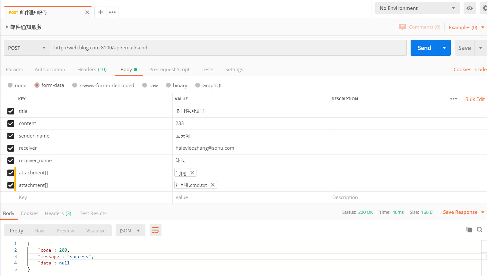

# 序言
本次主要使用 `golang` 重写 `email` 模块    

###### 注意
文件大小限制请在服务器层面完成,如 `nginx`  
目前属于单机部署版本,只因为附件是临时存储到本地的  

#### 要求清单

* 接收发邮件的 HTTP 请求
    - 异步队列
        - [x] RabbitMQ
            - [x] 单例连接
            - [x] 协程安全.以免并发导致的TCP报文交错
        - [ ] Kafka
        - [x] 整合为简单工厂
    - 附件
        - [x] 多附件上传
            - 发送邮件时因为意外操作导致丢失了的附件,会记录到数据表中
* 邮件发送服务
    - [x] 考虑邮件发送通道数、频率的限制
        - [x] 协程数量管控
    - [x] 邮件发送记录
* [ ] 服务 recover 与异常监控

## 工具

[json转go结构体](https://www.sojson.com/json/json2go.html)  
请注意json中的数据类型  

## 常用功能
基础工具命令都已集成到 [Makefile](Makefile)

> 生成配置文件

~~~bash
cp conf/app.ini.example conf/app.ini  
~~~

设置好配置文件后,生成配置文件到默认目录下

~~~bash
make ini
~~~

rabbitMQ 请配置 `exchange` 名为 `email_sender`  
rabbitMQ 请配置 `queue` 名为 `email_sender`  

数据库、表设置  
~~~sql
CREATE DATABASE common_service charset = utf8mb4;

DROP TABLE IF EXISTS `email`;
CREATE TABLE `email` (
`id` INT ( 1 ) UNSIGNED NOT NULL AUTO_INCREMENT,
`title` VARCHAR ( 255 ) NOT NULL DEFAULT '' COMMENT '邮件标题',
`content` text NOT NULL COMMENT '邮件内容',
`sender_name` VARCHAR ( 50 ) NOT NULL DEFAULT '' COMMENT '发件者姓名.发起方自定义',
`receiver` text NOT NULL COMMENT '接收者邮箱.多个以逗号隔开',
`receiver_name` text NOT NULL COMMENT '接收者姓名.多个以逗号隔开',
`attachment` VARCHAR ( 1000 ) NOT NULL DEFAULT '' COMMENT '附件信息',
`remark` VARCHAR ( 100 ) NOT NULL DEFAULT '' COMMENT '备注信息',
`is_ok` TINYINT ( 1 ) UNSIGNED NOT NULL DEFAULT '0' COMMENT '枚举值 0:发送成功,1:发送失败',
`is_deleted` TINYINT ( 1 ) UNSIGNED NOT NULL DEFAULT '0' COMMENT '枚举值 0:正常,1:删除',
`updated_at` datetime NOT NULL DEFAULT '1000-01-01 00:00:00' COMMENT '更新时间',
`created_at` TIMESTAMP NOT NULL DEFAULT CURRENT_TIMESTAMP COMMENT '创建时间',
PRIMARY KEY ( `id` ) USING BTREE,
KEY `idx-created_at` ( `created_at` ) USING BTREE 
) ENGINE = INNODB DEFAULT CHARSET = utf8mb4 ROW_FORMAT = COMPACT COMMENT = '邮件服务';
~~~

> 更多

###### 格式化代码

~~~bash
make tool
~~~

###### 单元测试

~~~bash
make test
~~~

[tesing 包文档](https://golang.google.cn/pkg/testing/)  
关于单元测试的书写  

~~~bash
文件必须以 ...test.go 结尾
测试函数必须以 TestX... 开头, X 可以是 _ 或者大写字母，不可以是小写字母或数字
参数：*testing.T
样本测试必须以 Example... 开头，输入使用注释的形式
TestMain 每个包只有一个，参数为 *testing.M
t.Error 为打印错误信息,并当前test case会被跳过
~~~

##### 示例运行

~~~bash
make build
./email_server
~~~

## 使用

#### 发送邮件

- API `127.0.0.1:8100/api/email/send`  
- 方式 `POST`
- 入参
    - `title` 邮件名
    - `content` 待发送正文,支持html
    - `sender_name` string 发件人昵称
    - `receiver` string 接收者邮箱.多个以逗号隔开
    - `receiver_name` string 接收者邮箱昵称,可以不填,多个以逗号隔开
    - `attachment[]` file 多个附件请使用相同变量名.请使用 form-data 进行传输

###### 示例:正常请求

~~~bash
{
    "code": 200,
    "message": "success",
    "data": null
}
~~~

###### 示例:异常请求

~~~bash
{
    "code": 1001,
    "message": "请求参数错误",
    "data": [
        "receiver 含格式不正确的邮箱地址"
    ]
}
~~~

###### 请求邮件通知服务

  
`图 001`  

###### 接收邮件

  
`图 002`  